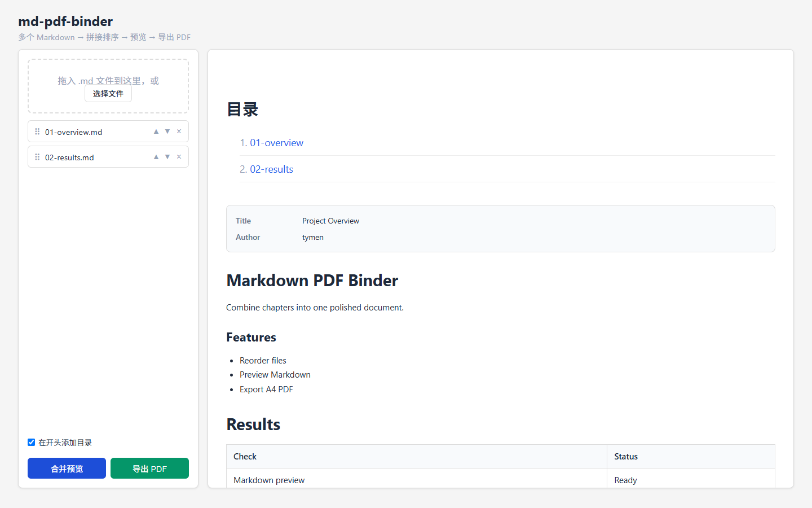

# md-pdf-binder

一个本地运行的 Web 工具，用于导入多个 Markdown 文件、调整顺序、预览合并效果，并导出为一份排版统一的 PDF。



## 功能

- 拖放或批量选择 `.md`、`.markdown` 和 `.txt` 文件
- 拖拽、按钮排序和单项移除
- 实时合并预览，支持 GFM 表格与代码语法高亮
- 解析 YAML frontmatter 并显示为元信息卡片
- 可选的文件级目录与文件间分页
- 通过系统安装的 Edge、Chrome 或 Chromium 导出 A4 PDF
- 文件仅在浏览器和本地 Node.js 进程中处理，不写入服务器临时目录

## 环境要求

- Node.js 22.12 或更高版本
- npm
- Microsoft Edge、Google Chrome 或 Chromium；Windows 10/11 自带的 Edge 即可

## 快速开始

```bash
git clone https://github.com/cannoyroy/md-pdf-binder.git
cd md-pdf-binder
npm install
npm start
```

浏览器打开 <http://127.0.0.1:3000>，选择 Markdown 文件后即可排序、预览和导出。可以用 `PORT` 环境变量修改端口：

```powershell
$env:PORT=8080
npm start
```

服务默认仅监听本机。如需在容器或局域网中访问，可另外设置 `HOST=0.0.0.0`，并自行配置访问控制。

程序会自动查找系统浏览器，普通用户无需配置。只有浏览器安装在非常规位置时，才需要通过可选的 `BROWSER_PATH` 指定可执行文件：

```powershell
$env:BROWSER_PATH="D:\Apps\Chrome\chrome.exe"
npm start
```

## YAML frontmatter

文件开头的 YAML frontmatter 会显示为元信息卡片：

```markdown
---
title: 示例报告
author: Zhang San
date: 2026-09-14
---

# 正文
```

无法解析的 frontmatter 会作为普通 Markdown 保留。目录按文件生成条目，不会展开文件内部的多级标题。

## API

### `POST /api/merge`

接收按顺序排列的文件，并返回合并后的 HTML：

```json
{
  "files": [
    { "name": "chapter-1.md", "content": "# 第一章" },
    { "name": "chapter-2.md", "content": "# 第二章" }
  ],
  "includeTOC": true
}
```

### `POST /api/export-pdf`

请求体与 `/api/merge` 相同，成功时返回 `application/pdf` 文件流。

## 项目结构

```text
md-pdf-binder/
├── .github/workflows/ci.yml  # GitHub Actions
├── docs/                     # README 图片
├── public/                   # 浏览器端页面、样式和交互
├── test/smoke.mjs            # 端到端冒烟测试
├── server.js                 # Express 服务与 PDF 导出
├── DESIGN.md                 # 设计说明
└── package.json
```

## 测试

```bash
npm test
```

测试会启动本地服务，检查首页、合并、frontmatter、目录、代码高亮，并实际生成一份 PDF。GitHub Actions 会在推送到 `main` 和 Pull Request 时运行依赖审计与相同测试。

## 安全与限制

本项目面向本地可信文档。Markdown 中的原始 HTML 会参与预览和 PDF 渲染，请不要导入来源不可信的文件，也不要在未增加内容隔离和访问控制的情况下直接部署为公开服务。

PDF 中的远程图片需要在导出时能够访问。字体效果取决于运行机器安装的字体；中文排版优先使用 Noto Serif SC 或思源宋体，缺失时会使用系统回退字体。精简 Linux 或容器环境通常没有预装浏览器，需要自行安装 Chromium 并设置 `BROWSER_PATH`。

这是 Node.js 服务，不能直接部署到 GitHub Pages。如需在线使用，应部署到支持 Node.js 和 Chromium 的服务器或容器平台。

## License

[MIT](LICENSE) © 2026 tymen
